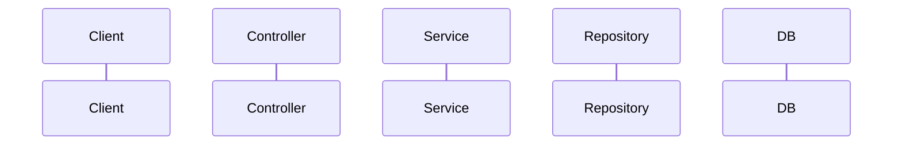

# OpenSpec 客製化設定完整指南

> 本文件從主教學指南獨立出來，涵蓋 OpenSpec 所有客製化相關的設定。

---

## 目錄

1. [客製化層級總覽](#1-客製化層級總覽)
2. [Project Config（專案設定）](#2-project-config)
3. [Schemas（可替換的骨架定義）](#3-schemas)
4. [Custom Schema 建立教學](#4-custom-schema-建立教學)
5. [Template 撰寫教學](#5-template-撰寫教學)
6. [多語言支援](#6-多語言支援)
7. [Schema CLI 指令參考](#7-schema-cli-指令參考)
8. [實戰範例 Schemas](#8-實戰範例-schemas)
9. [設定檢查與除錯](#9-設定檢查與除錯)

---

## 1. 客製化層級總覽

OpenSpec 提供三個層級的客製化，由淺到深：

| 層級 | 設定位置 | 用途 | 適合誰 |
|------|----------|------|--------|
| **Project Config** | `openspec/config.yaml` | 設定預設 schema、注入上下文與規則 | 大部分團隊 |
| **Custom Schema** | `openspec/schemas/<name>/` | 定義自己的 workflow artifacts | 有獨特流程的團隊 |
| **Global Overrides** | `~/.local/share/openspec/schemas/`（Linux/macOS）或 `%LOCALAPPDATA%/openspec/`（Windows） | 跨專案共用 schema | Power users |

**大部分情況只需要設定 Project Config 就夠了。** Custom Schema 是當內建的 `spec-driven` 骨架不符合你的流程時才需要。

---

## 2. Project Config

`openspec/config.yaml` 是最重要的客製化入口，控制 AI 生成 artifacts 的品質。

### 2.1 三個設定項

```yaml
# openspec/config.yaml

# ① schema — 預設使用的骨架定義
schema: spec-driven

# ② context — 注入到「所有」artifact 的 AI prompt
context: |
  ...

# ③ rules — 針對「特定」artifact 的規則
rules:
  proposal:
    - ...
  specs:
    - ...
```

#### 差異比較

| 設定項 | 注入範圍 | 用途 | 是否必填 |
|--------|----------|------|----------|
| `schema` | — | 預設 schema，省去每次打 `--schema` | 建議設定 |
| `context` | **所有** artifacts | 描述技術棧、架構、團隊慣例 | **強烈建議** |
| `rules.<artifact>` | 只有**對應** artifact | 針對性的生成規則 | 視團隊需求 |

### 2.2 `schema` 設定

設定後，所有指令自動使用此 schema：

```yaml
schema: spec-driven
```

```bash
# 有設定 → 不用指定
openspec new change my-feature

# 沒設定 → 每次都要指定
openspec new change my-feature --schema spec-driven
```

**Schema 解析優先順序：**

1. CLI flag: `--schema <name>`（最高優先）
2. Change metadata: `.openspec.yaml`（每個 change 可覆寫）
3. Project config: `openspec/config.yaml`（專案預設）
4. 預設值: `spec-driven`（兜底）

### 2.3 `context` 設定

Context 會被注入到**所有** artifact 的 AI prompt 中，讓 AI 了解你的專案背景。

#### 最小化版本

```yaml
context: |
  Tech stack: Java 17, Spring Boot 3.x, PostgreSQL
```

#### 完整版本

```yaml
context: |
  ## Tech Stack
  - Language: Java 17
  - Framework: Spring Boot 3.x
  - Build Tool: Gradle (Kotlin DSL)
  - Database: PostgreSQL 15 + Flyway migration
  - Cache: Redis
  - Message Queue: RabbitMQ
  - API Style: RESTful, OpenAPI 3.0 documented

  ## Architecture
  - Layered architecture: Controller → Service → Repository
  - Domain-Driven Design (DDD) for core business logic
  - CQRS pattern for read-heavy modules

  ## Conventions
  - Package naming: com.company.project.{domain}.{layer}
  - DTO suffix for data transfer objects
  - All public APIs must have Swagger annotations
  - Integration tests use Testcontainers

  ## Team
  - Backend team: 5 developers
  - Code review required before merge
  - CI/CD: GitHub Actions → AWS ECS
```

#### Context 寫作原則

- 寫 AI 需要知道但無法從 code 推斷的資訊
- 技術棧、架構風格、命名慣例、團隊流程
- 不要寫太長，保持在 20-30 行以內
- 可以用 Markdown 格式化

### 2.4 `rules` 設定

Rules 只注入到**對應** artifact 的 prompt，用來控制特定 artifact 的生成品質。

```yaml
rules:
  # proposal 專屬規則
  proposal:
    - 必須包含 rollback plan（回滾計畫）
    - 必須識別受影響的微服務
    - 必須評估對現有 API 的向後相容性影響
    - 如果涉及 DB schema 變更，必須說明 migration 策略

  # specs 專屬規則
  specs:
    - 使用 Given/When/Then (GWT) 格式撰寫 scenario
    - 必須包含 error scenario（異常情境）
    - API spec 必須包含 HTTP method、path、request/response 範例
    - 參考現有 specs 中的模式，避免發明新模式

  # design 專屬規則
  design:
    - 必須包含 sequence diagram 或 flow chart（可用 Mermaid）
    - 必須說明 DB schema 變更（如有）
    - 必須考慮 concurrency 和 thread safety
    - 必須評估 performance impact

  # tasks 專屬規則
  tasks:
    - 每個 task 必須可在 4 小時內完成
    - 必須包含單元測試和整合測試的 task
    - 必須包含 API 文件更新的 task（如果有 API 變更）
    - Task 順序應反映實際開發順序
```

#### Rules 的 key 必須對應 schema 中的 artifact id

如果你用的是內建 `spec-driven` schema，artifact id 為：`proposal`、`specs`、`design`、`tasks`。

如果你用 custom schema，key 要對應你自己定義的 artifact id。例如：

```yaml
# schema.yaml 中的 artifact id 是 "research"
artifacts:
  - id: research
    ...

# config.yaml 的 rules key 也要是 "research"
rules:
  research:
    - Must include at least 3 alternative approaches
```

### 2.5 AI Prompt 組裝方式

當 AI 生成某個 artifact 時，OpenSpec 會這樣組裝 prompt：

```xml
<context>
<!-- config.yaml 的 context，注入到所有 artifacts -->
Tech stack: Java 17, Spring Boot 3.x, PostgreSQL
Architecture: Controller → Service → Repository
...
</context>

<rules>
<!-- config.yaml 的 rules.<artifact>，只注入到對應 artifact -->
- 必須包含 rollback plan
- 必須識別受影響的微服務
</rules>

<dependencies>
<!-- 前置 artifact 的內容，由 schema 依賴關係決定 -->
[proposal.md 的內容]
</dependencies>

<template>
<!-- schema 的 template，定義 artifact 的結構 -->
[templates/proposal.md 的內容]
</template>

<instruction>
<!-- schema 中 artifact 的 instruction 欄位 -->
Create a proposal that explains WHY this change is needed.
</instruction>
```

---

## 3. Schemas

Schema = 可替換的骨架定義，決定你的 workflow 有哪些 artifacts、什麼順序組裝。

### 3.1 內建 Schema

**spec-driven**（預設且唯一的內建 schema）：

```
proposal → specs → design → tasks → implement
```

依賴圖：

```
              proposal
             (root node)
                 │
       ┌─────────┴─────────┐
       ▼                   ▼
    specs               design
 (requires:           (requires:
  proposal)            proposal)
       │                   │
       └─────────┬─────────┘
                 ▼
              tasks
          (requires:
          specs, design)
```

**重要概念：Dependencies 是 enablers，不是 gates。**

- 它們表示「什麼可以做」，不是「什麼必須做」
- 你可以跳過 design 如果不需要
- specs 和 design 可以平行建立（都只依賴 proposal）

### 3.2 Schema 來源優先順序

| 優先順序 | 來源 | 路徑 |
|----------|------|------|
| 1 (最高) | Project | `openspec/schemas/<name>/` |
| 2 | User | `~/.local/share/openspec/schemas/<name>/` |
| 3 (最低) | Package | 內建 schemas |

Project-level schema 推薦，因為可以跟 code 一起 version control。

### 3.3 Schema 結構

一個 schema 由兩部分組成：

```
openspec/schemas/<name>/
├── schema.yaml        # 骨架定義（artifacts、依賴、指示）
└── templates/         # Artifact 模板
    ├── proposal.md
    ├── spec.md
    ├── design.md
    └── tasks.md
```

#### `schema.yaml` 完整欄位

```yaml
name: my-workflow              # Schema 名稱（kebab-case）
version: 1                     # 版本號
description: My team's workflow  # 描述

artifacts:
  - id: proposal               # 唯一識別碼
    generates: proposal.md      # 輸出檔名
    description: Change proposal  # 描述
    template: proposal.md       # templates/ 下的模板檔
    instruction: |              # AI 生成指示
      Create a proposal...
    requires: []                # 依賴的 artifact ids

  - id: specs
    generates: specs/**/*.md    # 支援 glob pattern
    description: Delta specs
    template: spec.md
    instruction: |
      Create delta specs...
    requires:
      - proposal               # 必須有 proposal 才能建立

apply:
  requires: [tasks]             # 進入實作階段需要的 artifacts
  tracks: tasks.md              # 追蹤進度的檔案
```

#### 欄位說明

| 欄位 | 必填 | 說明 |
|------|------|------|
| `name` | Yes | Schema 名稱，kebab-case |
| `version` | Yes | 版本號 |
| `description` | No | 描述文字 |
| `artifacts` | Yes | Artifact 定義陣列 |
| `artifacts[].id` | Yes | 唯一識別碼，用在 `requires`、`rules` key、CLI |
| `artifacts[].generates` | Yes | 輸出檔名，支援 glob（如 `specs/**/*.md`） |
| `artifacts[].description` | No | 描述文字 |
| `artifacts[].template` | Yes | `templates/` 目錄下的模板檔名 |
| `artifacts[].instruction` | No | AI 生成此 artifact 時的額外指示 |
| `artifacts[].requires` | Yes | 依賴的 artifact id 陣列（空陣列 `[]` 表示無依賴） |
| `apply.requires` | Yes | 進入 `/opsx:apply` 前必須完成的 artifacts |
| `apply.tracks` | Yes | 追蹤實作進度的檔案 |

---

## 4. Custom Schema 建立教學

### 4.1 方式 A: Fork 現有 Schema（推薦）

最快的方式是 fork 內建 schema 再修改：

```bash
openspec schema fork spec-driven my-workflow
```

產出：

```
openspec/schemas/my-workflow/
├── schema.yaml           # 完整的 spec-driven 副本
└── templates/
    ├── proposal.md       # 可自由修改
    ├── spec.md
    ├── design.md
    └── tasks.md
```

然後你可以：
- 修改 `schema.yaml` 增刪 artifacts、改依賴關係
- 修改 `templates/` 改 artifact 的結構和引導
- 修改 `instruction` 欄位改 AI 的生成指示

### 4.2 方式 B: 從零建立

```bash
# 互動式（會問你問題）
openspec schema init my-workflow

# 非互動式（一行搞定）
openspec schema init rapid \
  --description "Rapid iteration workflow" \
  --artifacts "proposal,tasks" \
  --default
```

**Options：**

| 選項 | 說明 |
|------|------|
| `--description <text>` | Schema 描述 |
| `--artifacts <list>` | 逗號分隔的 artifact IDs（預設：`proposal,specs,design,tasks`） |
| `--default` | 設為專案預設 schema |
| `--no-default` | 不詢問是否設為預設 |
| `--force` | 覆蓋已存在的 schema |

### 4.3 設為預設

建立完 custom schema 後，有兩種方式設為預設：

```bash
# 方式 1: 建立時加 --default
openspec schema init my-workflow --default

# 方式 2: 手動編輯 config.yaml
```

```yaml
# openspec/config.yaml
schema: my-workflow
```

### 4.4 驗證 Schema

使用前務必驗證：

```bash
openspec schema validate my-workflow
```

檢查項目：
- `schema.yaml` 語法正確
- 所有 template 檔案存在
- 無循環依賴（A requires B, B requires A）
- Artifact IDs 合法

### 4.5 查看 Schema 解析結果

```bash
# 查看特定 schema 來自哪裡
openspec schema which my-workflow

# 輸出：
# Schema: my-workflow
# Source: project
# Path: /path/to/project/openspec/schemas/my-workflow

# 列出所有可用 schemas
openspec schema which --all
```

---

## 5. Template 撰寫教學

Templates 是 markdown 文件，引導 AI 生成 artifact 的結構。

### 5.1 基本原則

- 用 section headers 定義 AI 需要填寫的區塊
- 用 HTML comments 給 AI 指引（不會出現在最終輸出）
- 可以包含範例格式

### 5.2 Proposal Template 範例

```markdown
# Proposal: {{change-name}}

## Intent

<!-- 為什麼要做這個變更？解決什麼業務問題？ -->

## Scope

<!-- 這次變更包含什麼？不包含什麼？ -->

### In Scope
-

### Out of Scope
-

## Approach

<!-- 高層次的實作方向，不需要太細節 -->

## Impact Analysis

### Affected Services
<!-- 列出受影響的微服務 -->

### API Changes
<!-- 是否有新增/修改/廢棄的 API？是否向後相容？ -->

### Database Changes
<!-- 是否有 schema 變更？migration 策略？ -->

## Rollback Plan

<!-- 如果上線後出問題，如何回滾？ -->

## Risks

| Risk | Likelihood | Impact | Mitigation |
|------|-----------|--------|------------|
|      |           |        |            |
```

### 5.3 Spec Template 範例

```markdown
# Delta for {{domain}}

## ADDED Requirements

### Requirement: {{requirement-name}}

<!-- 用一句話描述這個需求 -->

#### API Contract

```
METHOD /api/v1/resource
```

**Request:**
```json
{}
```

**Response (200):**
```json
{}
```

#### Scenario: Happy path
- GIVEN
- WHEN
- THEN

#### Scenario: Error case
- GIVEN
- WHEN
- THEN the system returns an appropriate error response

## MODIFIED Requirements

## REMOVED Requirements
```

### 5.4 Design Template 範例

```markdown
# Design: {{change-name}}

## Architecture Overview

## Detailed Design

### Database Schema

```sql
-- V{version}__{description}.sql
```

### Domain Model

### Service Layer

### API Layer

```yaml
# OpenAPI snippet
paths:
  /api/v1/resource:
    post:
      summary:
      requestBody:
      responses:
```

## Sequence Diagram



## Performance Considerations

## Concurrency Considerations

## Dependencies

| Dependency | Version | Purpose |
|-----------|---------|---------|
```

### 5.5 Tasks Template 範例

```markdown
# Tasks

## 1. Database Migration
- [ ] 1.1 Create Flyway migration script
- [ ] 1.2 Test migration on local DB

## 2. Domain Layer
- [ ] 2.1 Create/update Entity classes
- [ ] 2.2 Create/update Value Objects

## 3. Service Layer
- [ ] 3.1 Create/update Service classes
- [ ] 3.2 Implement business logic

## 4. API Layer
- [ ] 4.1 Create/update DTOs
- [ ] 4.2 Create/update Controller
- [ ] 4.3 Add Swagger annotations

## 5. Testing
- [ ] 5.1 Unit tests for Service layer
- [ ] 5.2 Integration tests with Testcontainers
- [ ] 5.3 API tests (MockMvc)

## 6. Documentation
- [ ] 6.1 Update OpenAPI spec
```

---

## 6. 多語言支援

在 `config.yaml` 的 `context` 中加入語言指示即可，不需要額外設定。

### 繁體中文

```yaml
context: |
  語言：繁體中文（zh-TW）
  所有產出物必須用繁體中文撰寫。
  技術術語（API、REST、GraphQL）保留英文。
  程式碼和檔案路徑保留英文。
```

### 日文

```yaml
context: |
  言語：日本語
  すべての成果物は日本語で作成してください。
```

### 簡體中文

```yaml
context: |
  语言：中文（简体）
  所有产出物必须用简体中文撰写。
```

### 西班牙文

```yaml
context: |
  Idioma: Español
  Todos los artefactos deben escribirse en español.
```

### 技術術語處理

```yaml
context: |
  Language: Japanese
  Write in Japanese, but:
  - Keep technical terms like "API", "REST", "GraphQL" in English
  - Code examples and file paths remain in English
```

### 驗證語言設定

```bash
openspec instructions proposal --change my-change
# 輸出中會包含你的語言 context
```

---

## 7. Schema CLI 指令參考

### `openspec schema init <name>`

建立新 schema。

```bash
openspec schema init research-first
openspec schema init rapid --description "Fast workflow" --artifacts "proposal,tasks" --default
```

### `openspec schema fork <source> [name]`

Fork 現有 schema。

```bash
openspec schema fork spec-driven my-workflow
openspec schema fork spec-driven my-workflow --force  # 覆蓋已存在
```

### `openspec schema validate [name]`

驗證 schema 結構。

```bash
openspec schema validate my-workflow    # 驗證特定
openspec schema validate                # 驗證全部
openspec schema validate --verbose      # 詳細輸出
```

### `openspec schema which [name]`

查看 schema 來源。

```bash
openspec schema which spec-driven
openspec schema which --all
```

### `openspec schemas`

列出所有可用 schemas。

```bash
openspec schemas
openspec schemas --json
```

### `openspec templates`

查看 template 路徑。

```bash
openspec templates                      # 預設 schema
openspec templates --schema my-workflow  # 指定 schema
```

### `openspec instructions`

取得 artifact 生成指示（含 context + rules + template + dependencies）。

```bash
openspec instructions proposal --change add-dark-mode
openspec instructions design --change add-dark-mode --json
```

---

## 8. 實戰範例 Schemas

### 8.1 Rapid — 快速迭代

最少 overhead，適合小功能或 hotfix。跳過 specs 和 design。

```yaml
name: rapid
version: 1
description: Fast iteration with minimal overhead

artifacts:
  - id: proposal
    generates: proposal.md
    description: Quick proposal
    template: proposal.md
    instruction: |
      Create a brief proposal. Focus on what and why.
      Skip detailed specs — keep it under 1 page.
    requires: []

  - id: tasks
    generates: tasks.md
    description: Implementation checklist
    template: tasks.md
    instruction: |
      Create a concise task list. Each task should be actionable.
    requires: [proposal]

apply:
  requires: [tasks]
  tracks: tasks.md
```

```
流程：proposal → tasks → implement
```

### 8.2 With-Review — 含審核步驟

在 design 之後、tasks 之前加入 review 步驟。

```yaml
name: with-review
version: 1
description: Full workflow with mandatory review step

artifacts:
  - id: proposal
    generates: proposal.md
    template: proposal.md
    requires: []

  - id: specs
    generates: specs/**/*.md
    template: spec.md
    requires: [proposal]

  - id: design
    generates: design.md
    template: design.md
    requires: [specs]

  - id: review
    generates: review.md
    description: Pre-implementation review checklist
    template: review.md
    instruction: |
      Create a review checklist based on the design.
      Evaluate:
      - Security implications
      - Performance impact
      - Test coverage plan
      - Backward compatibility
      - Deployment considerations
      Flag any concerns that need resolution before implementation.
    requires: [design]

  - id: tasks
    generates: tasks.md
    template: tasks.md
    requires: [design, review]

apply:
  requires: [tasks]
  tracks: tasks.md
```

```
流程：proposal → specs → design → review → tasks → implement
```

### 8.3 Research-First — 先研究再提案

適合技術選型或複雜問題。

```yaml
name: research-first
version: 1
description: Research before committing to an approach

artifacts:
  - id: research
    generates: research.md
    description: Technical research and options analysis
    template: research.md
    instruction: |
      Research the problem space. List at least 3 approaches.
      Compare pros/cons of each. Recommend one with justification.
    requires: []

  - id: proposal
    generates: proposal.md
    template: proposal.md
    instruction: |
      Create a proposal based on the research findings.
      Reference the chosen approach from research.md.
    requires: [research]

  - id: tasks
    generates: tasks.md
    template: tasks.md
    requires: [proposal]

apply:
  requires: [tasks]
  tracks: tasks.md
```

```
流程：research → proposal → tasks → implement
```

### 8.4 Spring Boot Dev — 開發流程（整合 Skills）

整合 `spring-boot-scaffolds` plugin 的 skills，在 tasks 中混合自動化（skill）與手動步驟。

**適用場景：** 有現成 skills（如 `/scaffold-jpa`、`/gen-api-task`、`/refactor`）可加速開發時。

```
流程：proposal → specs → design → tasks → apply
                                   ↑            ↑
                          含「可自動化元件」  按 🤖/✋ 標籤執行
```

```yaml
name: spring-boot-dev
version: 1
description: Spring Boot 開發流程，整合 scaffold skills 自動化程式碼生成

artifacts:
  - id: proposal
    generates: proposal.md
    description: 變更提案，說明動機、範圍和影響
    template: proposal.md
    instruction: |
      建立變更提案（繁體中文）。必須包含：
      - 為什麼要做這個變更（業務價值）
      - 變更範圍（In Scope / Out of Scope）
      - 受影響的 layers（Controller / Service / Repository）
      - 是否需要 DB migration
      - 對現有 API 的向後相容性影響
      - Rollback 策略
    requires: []

  - id: specs
    generates: specs/**/*.md
    description: Delta specs，定義新增/修改/移除的需求
    template: spec.md
    instruction: |
      建立 delta specs（繁體中文）。
      - 使用 Given/When/Then 格式撰寫所有 scenario
      - 包含 happy path 和 error/edge case
      - API contract 須包含 HTTP method、path、request/response 範例
      - Response 格式統一使用 ReturnMsg<T>（returnCode, data, msg）
      - 按 domain 拆分，每個 domain 一個 spec 檔案
    requires:
      - proposal

  - id: design
    generates: design.md
    description: 技術設計文件，含架構決策和實作細節
    template: design.md
    instruction: |
      建立技術設計文件（繁體中文）。必須包含：
      - 受影響的 layers 和元件
      - DB schema 變更（Flyway migration SQL）
      - OpenAPI snippet
      - Sequence diagram（Mermaid format，使用 autonumber）
      - Class diagram（Entity 用 @Getter + domain methods，Service 用 Interface + Impl）
      - Performance / Concurrency 考量

      在「可自動化元件」章節中，標註哪些部分可用以下 skills 自動生成：
      - /scaffold-jpa：新增 Entity 時，生成 Entity/Repository/Service/Controller/DTO/Mapper
      - /gen-api-task：有 OpenAPI spec 時，生成 API Interface + DTO
      - /scaffold-gcp-secret：需要 GCP Secret Manager 整合時
    requires:
      - specs

  - id: tasks
    generates: tasks.md
    description: 實作任務清單，混合 skill 自動步驟與手動步驟
    template: tasks.md
    instruction: |
      建立實作任務清單（繁體中文）。每個 task 須在 4 小時內完成。
      每個 task 須標註類型標籤：
      - 🤖 [自動] — 使用 skill 自動生成
      - ✋ [手動] — 需要手動撰寫

      任務順序：
      1. 前置準備（確認 /scaffold-rules 和 /scaffold-static-analysis 已部署）
      2. DB Migration（Flyway）
      3. 程式碼骨架生成（/scaffold-jpa 三步驟流程 或 /gen-api-task）
      4. 商業邏輯實作（手動）
      5. 單元測試 + 整合測試（Testcontainers）
      6. 品質檢查（/refactor）
      7. API 文件更新

      根據 design.md 的「可自動化元件」章節決定使用哪些 skills。
      每個 skill task 須包含完整的 slash command 和參數。
    requires:
      - design

apply:
  requires: [tasks]
  tracks: tasks.md
  instruction: |
    按照 tasks.md 的順序逐步執行。
    - 🤖 [自動] 標籤的 task：直接執行對應的 slash command
    - ✋ [手動] 標籤的 task：依據 design.md 和 specs 實作
    完成每個 task 後勾選 checkbox。
```

#### 關鍵設計：`design.md` 的「可自動化元件」章節

這是連接 OpenSpec workflow 和現有 skills 的橋樑：

```markdown
## 可自動化元件

| 元件 | Skill | 指令 | 說明 |
|------|-------|------|------|
| Entity + MVC 全套 | /scaffold-jpa | `/scaffold-jpa-schema <EntityName>` → `/scaffold-jpa-task` → `/scaffold-jpa` | 新增 Entity 時使用 |
| API Interface + DTO | /gen-api-task | `/gen-api-task` | 有 OpenAPI spec 時使用 |
```

AI 在生成 `tasks.md` 時會參考此表，自動編排 🤖 自動步驟。

#### 搭配的 `config.yaml`

```yaml
schema: spring-boot-dev

context: |
  ## Available Skills (spring-boot-scaffolds plugin)
  - /scaffold-jpa — JPA Entity/Repository/Service/Controller/DTO/Mapper 全套生成
  - /gen-api-task — OpenAPI spec → Java API Interface + DTO
  - /refactor — 7 階段系統化重構
  - /scaffold-rules — 部署 coding standards
  - /scaffold-static-analysis — 部署 Checkstyle + PMD + Git Hooks
  - /scaffold-gcp-secret — GCP Secret Manager 整合

rules:
  tasks:
    - 若涉及新增 Entity，必須包含「🤖 執行 /scaffold-jpa」步驟
    - 若涉及新 API endpoint 且有 OpenAPI spec，必須包含「🤖 執行 /gen-api-task」步驟
    - 最後一個功能性 task 必須是「🤖 執行 /refactor 品質檢查」
```

### 8.5 Spring Boot Analysis — 分析流程（整合 /generate-sd）

從 PRD 出發，經過程式碼掃描和設計決策，最終呼叫 `/generate-sd` skill 產出完整 System Design 文件。

**適用場景：** 拿到 PRD 後，需要先分析現有 codebase 再產出 SD 文件時。

```
流程：requirements → codebase-scan → design-decisions → system-design
                                                              ↑
                                                        呼叫 /generate-sd
                                                        引用前三個 artifacts
```

```yaml
name: spring-boot-analysis
version: 1
description: Spring Boot 分析流程，從 PRD 到 System Design 文件（整合 /generate-sd skill）

artifacts:
  - id: requirements
    generates: requirements.md
    description: 需求解析，從 PRD 抽取結構化需求清單
    template: requirements.md
    instruction: |
      解析 PRD 文件，產出結構化需求清單（繁體中文）。
      - 抽取所有需求 ID（支援 FR-xxx、BE-xxx、NFR-xxx、FEATURE-xxx 格式）
      - 分類：功能需求 vs 非功能需求
      - 識別功能類型：新增功能 / 變更需求 / 修復
      - 列出每個需求的簡要描述和驗收條件
      - 標註需求間的依賴關係（如有）

      使用者須在提案時提供 PRD 文件路徑。
    requires: []

  - id: codebase-scan
    generates: codebase-scan.md
    description: 程式碼庫掃描報告，分類現有元件為 Reuse/Modify/Create
    template: codebase-scan.md
    instruction: |
      掃描現有 Spring Boot 程式碼庫（繁體中文）。
      掃描順序：Entity → Repository → Service → Controller → DTO → Mapper → Config

      對每個元件判斷：
      - ♻️ Reuse（完全可重用，無需修改）
      - ✏️ Modify（部分符合，需新增欄位或方法）
      - 🆕 Create（無現有元件，需全新建立）

      產出格式為三張表格（Reuse / Modify / Create），每列包含：
      - 元件路徑
      - 元件類型（Entity/Service/Controller 等）
      - 對應的需求 ID
      - 用途說明或需要的修改內容

      使用者須在提案時提供程式碼庫根路徑。
    requires:
      - requirements

  - id: design-decisions
    generates: design-decisions.md
    description: 設計決策紀錄，包含 DB/API/元件設計方案
    template: design-decisions.md
    instruction: |
      根據 requirements 和 codebase-scan 的結果，產出設計決策（繁體中文）。
      分四個面向：

      1. 元件重用策略：確認哪些元件 Reuse/Modify/Create，說明理由
      2. 設計方案：針對核心功能提出設計方向（DB schema、API 設計、商業邏輯）
      3. 資料庫設計：ERD、欄位定義、migration 策略；若使用者有提供現有 schema，進行比對
      4. 輸出規劃：SD 文件的輸出路徑和檔名

      每個決策須包含：
      - 決策項目
      - 可選方案（至少 2 個）
      - 選定方案和理由
      - 影響範圍
    requires:
      - codebase-scan

  - id: system-design
    generates: system-design.md
    description: 完整的 System Design 文件（由 /generate-sd skill 產出）
    template: system-design.md
    instruction: |
      根據前面三個 artifacts 的分析結果，執行 /generate-sd 產出完整的 SD 文件。

      執行前準備：
      - 將 requirements.md 的需求清單作為 /generate-sd Phase 1 的輸入
      - 將 codebase-scan.md 的元件分類作為 /generate-sd Phase 2 的輸入
      - 將 design-decisions.md 的設計決策作為 /generate-sd Phase 3 的輸入

      執行 /generate-sd 時：
      - Phase 1（輸入解析）：引用 requirements.md，跳過重複解析
      - Phase 2（程式碼掃描）：引用 codebase-scan.md，跳過重複掃描
      - Phase 3（互動確認）：引用 design-decisions.md 作為預設方案，僅確認差異
      - Phase 4-6：正常執行（生成 SD → 品質驗證 → 輸出確認）

      最終 SD 文件須包含：
      - 文件資訊（版本、日期、相關 PRD）
      - 後端架構設計（Component diagram）
      - 資料庫設計（ERD + 資料表規格 + Migration script）
      - API 設計（Endpoint 總覽 + 詳細規格，Response 使用 ReturnMsg<T>）
      - Class 設計（Entity class diagram + Service class diagram）
      - Sequence Diagram（每個 API 的主要流程）
      - 測試規格（測試案例表）
      - 附錄：需求追溯矩陣（100% 覆蓋率）
    requires:
      - design-decisions

apply:
  requires: [system-design]
  tracks: system-design.md
```

#### 方案 B 的設計理念：為什麼不把 SD template 搬進 OpenSpec？

`/generate-sd` skill 自帶完整的 references（mermaid-patterns、sd-section-guide、spring-boot-scan-guide）和 assets（sd-template）。如果把這些搬進 OpenSpec schema 的 templates 目錄，會導致：

1. **維護兩份**：skill 更新時 schema 也要同步更新
2. **失去 skill 生態**：`/generate-sd` 的品質驗證、互動確認等邏輯無法用 template 表達

因此採用 **方案 B**：OpenSpec 負責前三個階段的結構化分析（requirements → codebase-scan → design-decisions），最後一個 artifact 引導 AI 呼叫 `/generate-sd`，並將前面的分析結果作為輸入，避免重複工作。

#### 搭配的 `config.yaml`

```yaml
schema: spring-boot-analysis

context: |
  ## Available Skills
  - /generate-sd — PRD → System Design 文件（6 階段互動式流程）

  ## SD 文件規範
  - Response 格式：ReturnMsg<T>（returnCode, data, msg）
  - Entity：@Getter + domain methods，Enum 定義在 Entity 內部
  - Service：Interface + Impl 模式，無 I prefix
  - DTO：Java record + Jakarta Validation
  - Mermaid：autonumber, 繁體中文 participant labels

rules:
  requirements:
    - 需求 ID 格式必須為 FR-xxx、BE-xxx、NFR-xxx 或 FEATURE-xxx
    - 必須區分功能需求和非功能需求
  codebase-scan:
    - 掃描順序必須為 Entity → Repository → Service → Controller → DTO → Mapper → Config
    - 每個元件必須標註對應的需求 ID
  design-decisions:
    - 每個決策必須包含至少 2 個可選方案
    - 資料庫設計必須標註欄位來源（PRD / User Schema / AI 推斷）
  system-design:
    - 需求追溯矩陣必須達 100% 覆蓋率
    - 所有 Mermaid diagram 必須遵循 mermaid-patterns 標準
```

### 8.6 如何選擇 Schema？

| 場景 | 推薦 Schema | 理由 |
|------|-------------|------|
| 小功能、hotfix | `rapid` | 最少 overhead，跳過 specs 和 design |
| 一般開發（無 skills） | `spec-driven` | 內建預設，通用流程 |
| Spring Boot 開發（有 skills） | `spring-boot-dev` | 整合 scaffold skills，自動化程式碼生成 |
| 需要先分析再設計 | `spring-boot-analysis` | 結構化分析 + /generate-sd 產出 SD |
| 需要審核步驟 | `with-review` | design 後加 review gate |
| 技術選型、複雜問題 | `research-first` | 先研究再提案 |
| **先分析再開發** | **先 `spring-boot-analysis`，再 `spring-boot-dev`** | 兩條 pipeline 串接 |

#### 串接兩條 Pipeline

先用 `spring-boot-analysis` 產出 SD 文件，再用 `spring-boot-dev` 開發：

```bash
# Phase 1: 分析（產出 SD）
openspec new change order-api --schema spring-boot-analysis
openspec propose order-api

# Phase 2: 開發（基於 SD 實作）
openspec new change order-api-impl --schema spring-boot-dev
# 在 proposal 中引用上一步產出的 SD 文件
openspec propose order-api-impl
openspec apply order-api-impl
```

---

## 9. 設定檢查與除錯

### 確認目前使用哪個 Schema

```bash
openspec schema which --all
```

### 確認 Schema 是否合法

```bash
openspec schema validate my-workflow --verbose
```

### 確認 AI 看到的完整 Prompt

```bash
openspec instructions proposal --change my-change --json
```

這會輸出包含 context、rules、template、dependencies 的完整指示。

### 常見問題

| 問題 | 原因 | 解法 |
|------|------|------|
| Schema not found | 拼字錯誤或路徑不對 | `openspec schemas` 列出所有 |
| Template not found | schema.yaml 中的 template 欄位指向不存在的檔案 | `openspec schema validate` |
| Rules 沒生效 | rules key 跟 artifact id 不一致 | 確認 `rules.<key>` 對應 schema 中的 `artifacts[].id` |
| Context 沒生效 | config.yaml 語法錯誤（YAML indentation） | `openspec config list` 確認讀取正確 |
| Circular dependency | A requires B, B requires A | `openspec schema validate` 會偵測 |
| Artifacts 品質差 | context 和 rules 不夠具體 | 加入更多專案資訊和規則 |

### 檢查清單

設定 Custom Schema 前的完整 checklist：

- [ ] **config.yaml** — `schema` 設為你的 custom schema 名稱
- [ ] **config.yaml** — `context` 描述了技術棧和架構
- [ ] **config.yaml** — `rules` 針對每個 artifact 設了規則
- [ ] **schema.yaml** — 定義了所有需要的 artifacts
- [ ] **schema.yaml** — 依賴關係正確（無循環）
- [ ] **schema.yaml** — `apply.requires` 和 `apply.tracks` 正確
- [ ] **templates/** — 每個 artifact 都有對應的模板檔
- [ ] **驗證** — `openspec schema validate` 通過
- [ ] **測試** — 用 `openspec instructions` 確認 AI 看到的 prompt 正確

---

## 參考

- [主教學指南](../README.md) — OpenSpec 完整教學
- [sample-project/](../sample-project/) — 可直接複製使用的 Spring Boot 範例
- [examples/](../examples/) — 各種 config 和 schema 範例
- [官方文件](https://github.com/Fission-AI/OpenSpec)
