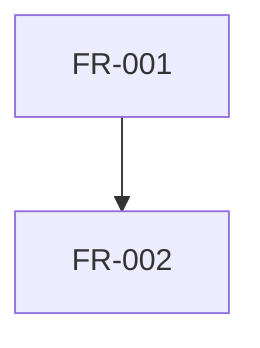

# 需求解析：{{change-name}}

## PRD 來源

- 檔案路徑：<!-- PRD 文件路徑 -->
- 版本：
- 日期：

## 功能需求（Functional Requirements）

| 需求 ID | 類型 | 簡要描述 | 驗收條件 | 依賴 |
|---------|------|---------|---------|------|
| FR-001 | 新增/變更/修復 | | | |

## 非功能需求（Non-Functional Requirements）

| 需求 ID | 類別 | 簡要描述 | 驗收條件 |
|---------|------|---------|---------|
| NFR-001 | 效能/安全/可用性 | | |

## 需求依賴圖

<!-- 需求間的依賴關係，若有 -->

## 功能類型摘要

| 類型 | 數量 | 需求 ID |
|------|------|---------|
| 新增功能 | | |
| 變更需求 | | |
| 修復 | | |
