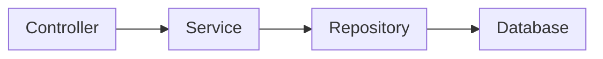
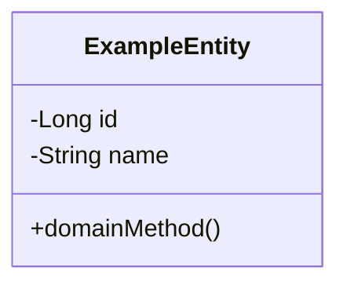
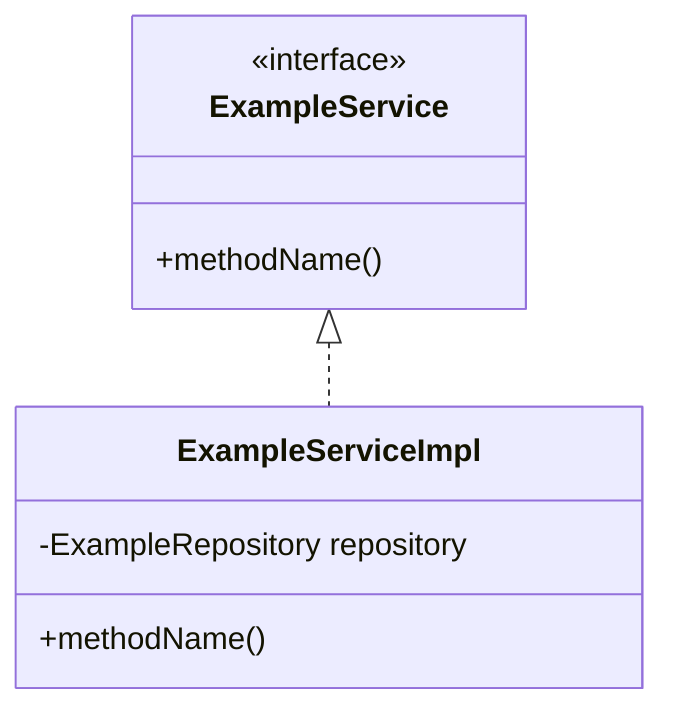
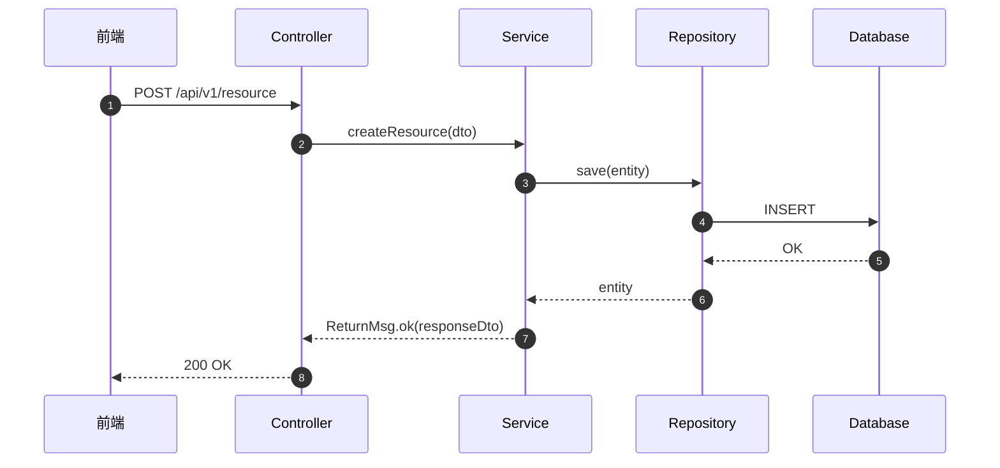

# 技術設計：{{change-name}}

## 架構概觀

<!-- 哪些 layers 受影響 -->



## 詳細設計

### 資料庫 Schema

```sql
-- V{version}__{description}.sql
```

### Domain Model

<!-- Entity 設計：@Getter + domain methods，Enum 定義在 Entity 內部 -->



### Service Layer

<!-- Interface + Impl 模式 -->



### API Layer

<!-- Controller + DTO（record）設計 -->

```yaml
# OpenAPI snippet
paths:
  /api/v1/resource:
    post:
      summary:
      requestBody:
      responses:
        '200':
          description: ReturnMsg<T>
```

## Sequence Diagram



## 可自動化元件

<!-- 標註哪些部分可用 skills 自動生成 -->

| 元件 | Skill | 指令 | 說明 |
|------|-------|------|------|
| Entity + MVC 全套 | /scaffold-jpa | `/scaffold-jpa-schema <EntityName>` → `/scaffold-jpa-task` → `/scaffold-jpa` | 新增 Entity 時使用 |
| API Interface + DTO | /gen-api-task | `/gen-api-task` | 有 OpenAPI spec 時使用 |
| GCP Secret | /scaffold-gcp-secret | `/scaffold-gcp-secret` | 需要 Secret Manager 時使用 |

## Performance 考量

<!-- QPS 預估、Cache 策略、Index 設計 -->

## Concurrency 考量

<!-- Race condition？樂觀鎖 / 悲觀鎖？ -->

## 依賴

| 依賴 | 版本 | 用途 |
|------|------|------|
|      |      |      |
