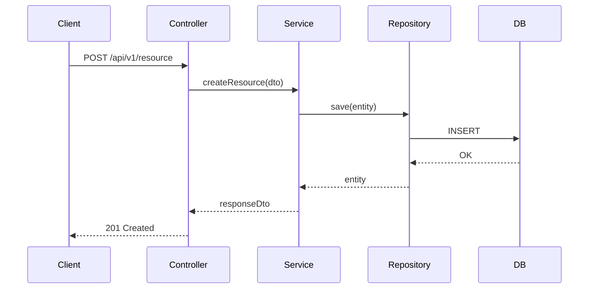

# Design: {{change-name}}

## Architecture Overview

<!-- 哪些層會被影響？畫出高層次架構 -->

```
Controller → Service → Repository → Database
```

## Detailed Design

### Database Schema

<!-- Flyway migration 計畫 -->

```sql
-- V{version}__{description}.sql
```

### Domain Model

<!-- Entity / Value Object 設計 -->

```java
// 範例 Entity 結構
@Entity
public class Example {
}
```

### Service Layer

<!-- 核心業務邏輯 -->

### API Layer

<!-- Controller 和 DTO 設計 -->

```yaml
# OpenAPI snippet
paths:
  /api/v1/resource:
    post:
      summary:
      requestBody:
      responses:
```

## Sequence Diagram



## Performance Considerations

<!-- 預期 QPS、是否需要 cache、index 策略 -->

## Concurrency Considerations

<!-- 是否有 race condition？樂觀鎖 / 悲觀鎖？ -->

## Dependencies

<!-- 依賴的外部服務或套件 -->

| Dependency | Version | Purpose |
|-----------|---------|---------|
|           |         |         |
